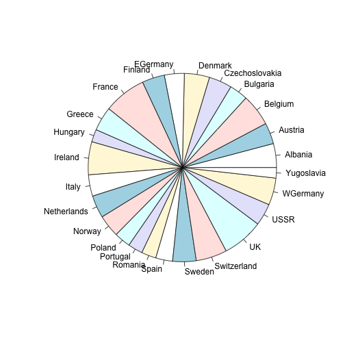

FreeDataSources
========================================================
author: Stanislav O. Pogrebnyak
date: 2015-04-26

Motivation
========================================================

To test some dependencies and try different data techniques it is very important to have sufficient enough data. You can find a lot of free data sources, clearly showing you particular problem, dependency and prepared to be best source for some solutions. 


Some examples of data sources
========================================================

- http://lib.stat.cmu.edu/DASL/allsubjects.html
- http://datamob.org/
- http://www.statsci.org/datasets.html
- http://www.amstat.org/publications/jse/jse_data_archive.htm
- http://www.stat.ncsu.edu/research/sas/sicl/data/

Example of data used in project assignment
========================================================


|Country        | RedMeat| WhiteMeat| Eggs| Milk| Fish| Cereals| Starch| Nuts| FruitsAndVegetables|
|:--------------|-------:|---------:|----:|----:|----:|-------:|------:|----:|-------------------:|
|Albania        |    10.1|       1.4|  0.5|  8.9|  0.2|    42.3|    0.6|  5.5|                 1.7|
|Austria        |     8.9|      14.0|  4.3| 19.9|  2.1|    28.0|    3.6|  1.3|                 4.3|
|Belgium        |    13.5|       9.3|  4.1| 17.5|  4.5|    26.6|    5.7|  2.1|                 4.0|
|Bulgaria       |     7.8|       6.0|  1.6|  8.3|  1.2|    56.7|    1.1|  3.7|                 4.2|
|Czechoslovakia |     9.7|      11.4|  2.8| 12.5|  2.0|    34.3|    5.0|  1.1|                 4.0|
|Denmark        |    10.6|      10.8|  3.7| 25.0|  9.9|    21.9|    4.8|  0.7|                 2.4|

Code for rendering example of data used in project assignment
========================================================


```r
library(knitr)
d.in = read.csv("data.csv", header = TRUE, sep = ";")
kable(head(d.in), format = "markdown")
```

Example of rendering in presentation based on free datasets
========================================================

 


Some links
========================================================

- Course https://class.coursera.org/devdataprod-013
- Github repository https://github.com/cthulhu/coursera-devdataprod
- This presentation http://rpubs.com/cthulhu/presentation
- Shiny application https://cthulhu.shinyapps.io/devdataprod-project/
